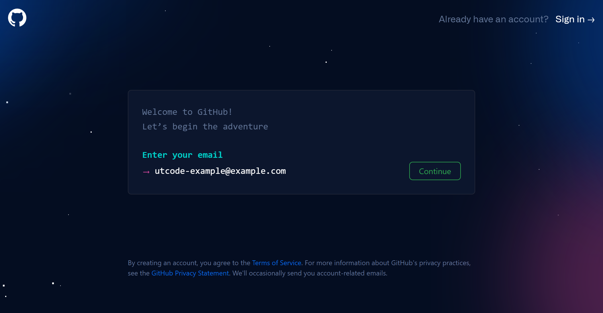
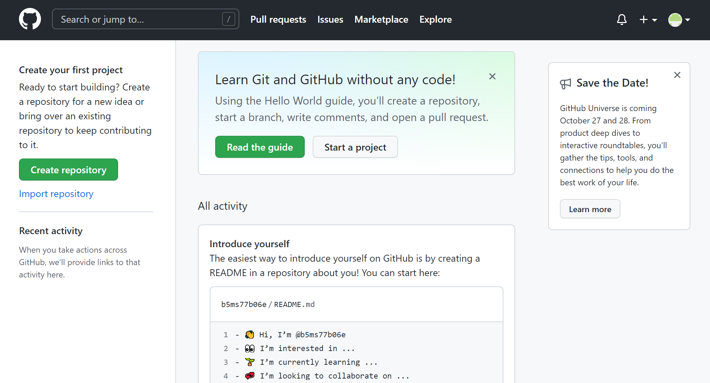
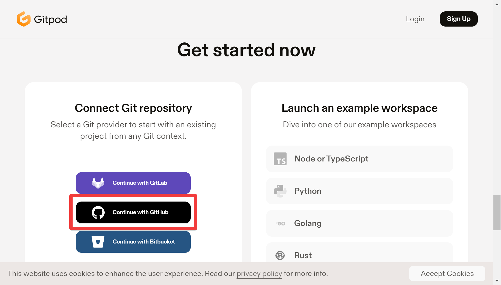
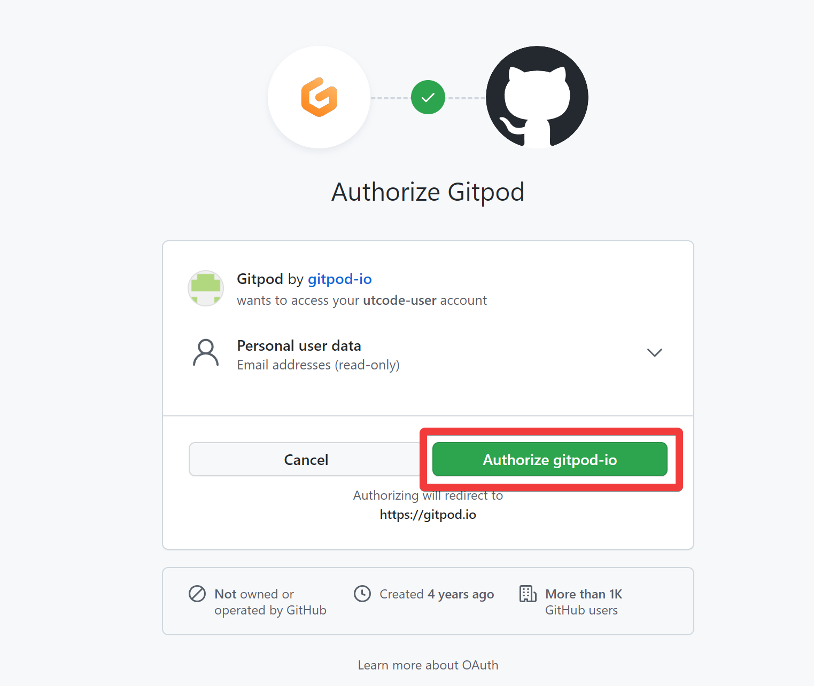

import Term from "@site/src/components/Term";
import addOauthScopeVideo from "./00-prepare/add-oauth-scope.mp4";
import openInGitpodVideo from "./00-prepare/open-in-gitpod.mp4";

この講座では、<Term type="github">GitHub</Term> と <Term type="gitpod">Gitpod</Term> の 2 つのサービスを利用します。登録にはあまり時間を要しませんが、スムーズな進行のため、事前の登録をお願いしています。

## <Term type="github">GitHub</Term> への登録

[<Term type="github">GitHub</Term>](https://github.com/) は、<Term type="git">Git</Term> と呼ばれる仕組みにより、プログラムの保存、共有、公開などができる、開発者のための総合プラットフォームです。多くの開発者が利用しているサービスです。

ますは [https://github.com/signup](https://github.com/signup) にアクセスします。

必要な情報を入力し、 <Term type="github">GitHub</Term> への登録を完了させましょう。

## <Term type="gitpod">Gitpod</Term> の登録

<Term type="gitpod">Gitpod</Term> は、<Term type="github">GitHub</Term> 等に保存されているプログラムをブラウザ上で編集するためのサービスです。

まずは [https://www.gitpod.io/#get-started](https://www.gitpod.io/#get-started) にアクセスします。

<Term type="github">GitHub</Term> でログインしましょう。

## <Term type="gitpod">Gitpod</Term> に <Term type="github">GitHub</Term> への権限を与える

標準では、<Term type="gitpod">Gitpod</Term> は <Term type="github">GitHub</Term> に対し読み取り権限しか持ちません。適切な権限を設定することにより、<Term type="gitpod">Gitpod</Term> が <Term type="github">GitHub</Term> に書き込みできるようになります。

[https://gitpod.io/integrations](https://gitpod.io/integrations) にアクセスします。下の動画を参考に、`GitHub` の `public_repo` 権限を有効化しましょう。

<video src={addOauthScopeVideo} controls />

## サンプル<Term type="repository">リポジトリ</Term>を<Term type="fork">フォーク</Term>して <Term type="gitpod">Gitpod</Term> で開く

:::info
この手順は、講習会当日にも実施する必要があります。
:::

<Term strong type="fork">フォーク</Term>と呼ばれる操作により、サンプルコードをコピーして自分のものにしたうえで、<Term type="gitpod">Gitpod</Term> で開き、プログラムを書くための準備をします。

- [https://github.com/ut-code/gitpod-web-starter](https://github.com/ut-code/gitpod-web-starter) にアクセスし、 `Fork` をクリックする。
- フォークが完了したら、URL の先頭に `gitpod.io/#` をつけた URL にアクセスする

<video src={openInGitpodVideo} controls />
