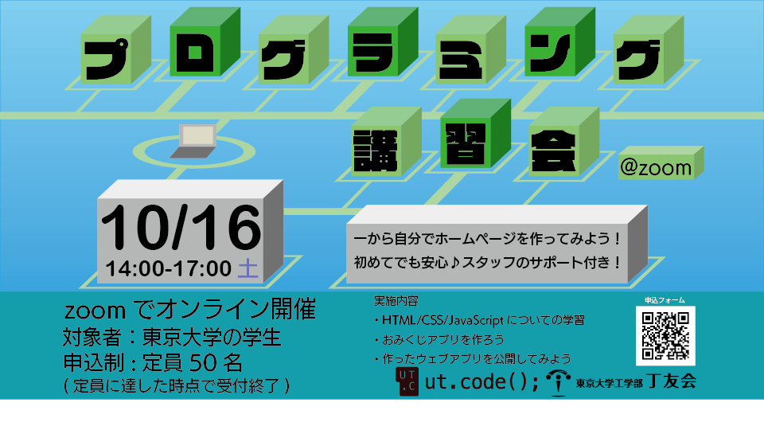

本日はお集まりいただき、ありがとうございます。この企画は、東京大学工学部丁友会と、東京大学のプログラミングサークル ut.code(); による共同企画です。

## タイムスケジュール

本企画は、次のタイムスケジュールに沿って進行します。

| 時刻           | 内容                                           |
| -------------- | ---------------------------------------------- |
| 14:05 ～ 14:20 | [HTML](./03-html.md)                           |
| 14:20 ～ 14:30 | [CSS](./04-css.md)                             |
| 14:30 ～ 14:40 | [JavaScript ことはじめ](./05-javascript.md)    |
| 14:40 ～ 14:50 | [値と式と演算子](./06-expressions.md)          |
| 14:50 ～ 14:55 | [変数](./07-variables.md)                      |
| 14:55 ～ 15:05 | [論理値](./08-boolean.md)                      |
| 15:05 ～ 15:30 | [条件分岐](./09-if-statement.md)               |
| 15:30 ～ 15:40 | [関数](./10-functions.md)                      |
| 15:40 ～ 15:50 | [DOM](./11-dom.md)                             |
| 15:50 ～ 16:00 | [イベント](./12-events.md)                     |
| 16:00 ～ 16:55 | [プロジェクト](./13-project.md)                |
| 16:55 ～ 17:00 | [作ったウェブアプリを公開する](./14-deploy.md) |
