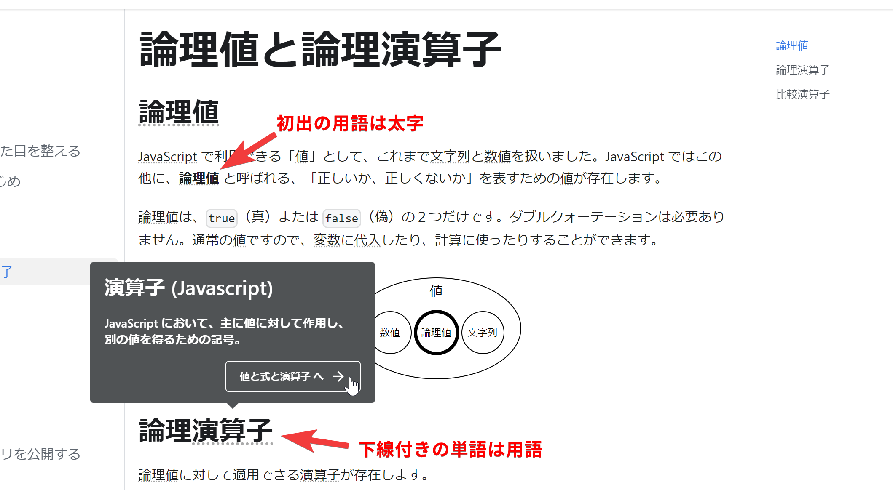
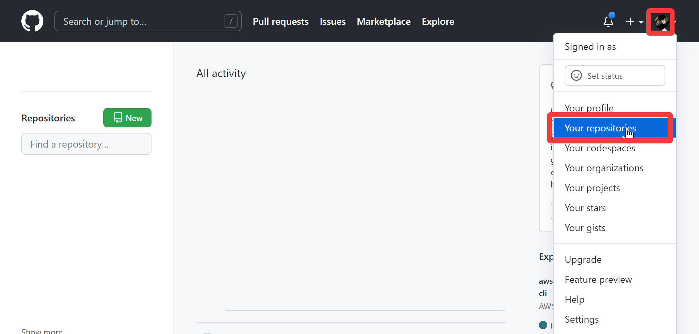
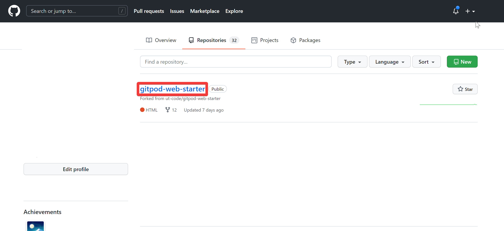
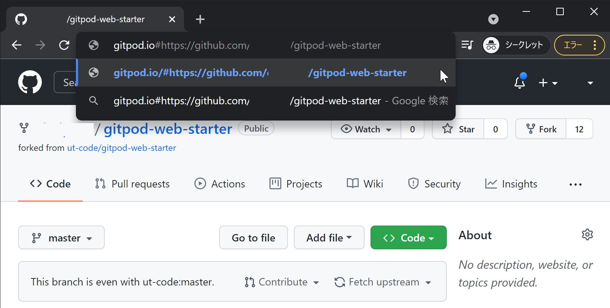
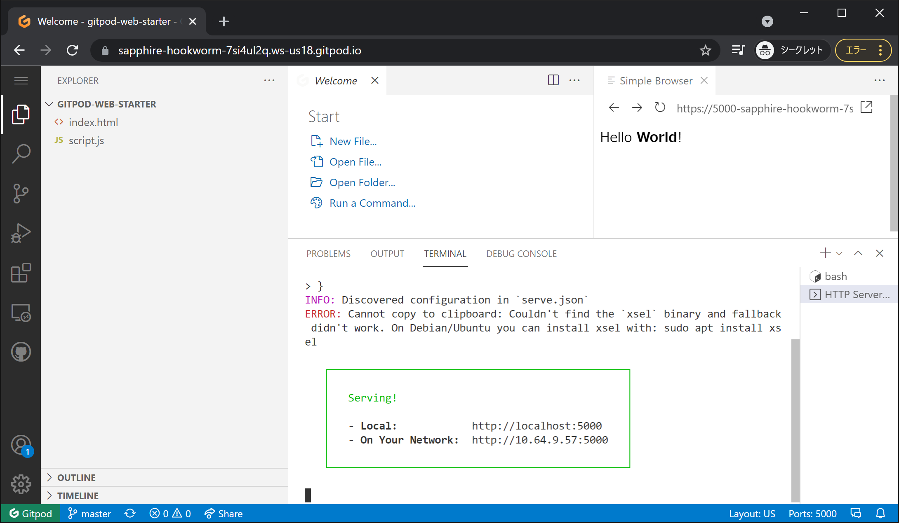

import Term from "@site/src/components/Term";

それでは、プログラミングを始めるための準備をしていきましょう。

:::caution
このページの手順は、[事前準備](./00-prepare.md)の手順を終えている前提で記述されています。未完了の場合は、そちらから実施してください。
:::

## このドキュメントの読み方について

このドキュメントは、Web 開発で用いられる用語を、一般的な語と区別できるよう記述されています。これらは点線の下線が引かれており、マウスカーソルを合わせるとその意味を表示できます。用語が初めてドキュメント内で言及されたページが別に存在すれば、そのページへのリンクも表示されます。

また、初出の用語は特に太字で表しています。

## <Term type="fork">フォーク</Term>した<Term type="repository">リポジトリ</Term>を <Term type="gitpod">Gitpod</Term> で開く

それでは、開発環境を起動しましょう。

まずは、[GitHub のトップページ](https://github.com/)で、画面右上のアバターをクリックし、メニューから `Your Repositories` を選択します。

`gitpod-web-starter` を開きます。

[事前準備](./00-prepare.md)と同様の手順で、`gitpod.io#`を URL の先頭に加えます。

<Term type="gitpod">Gitpod</Term>が起動しました。

