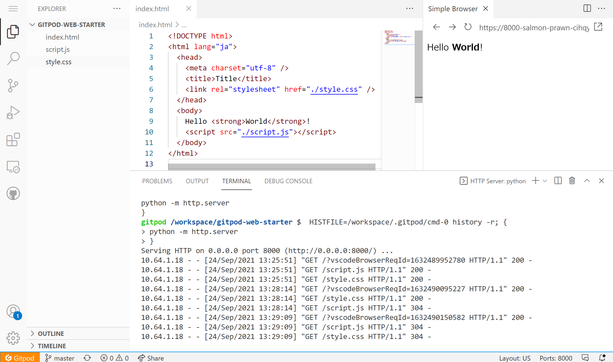
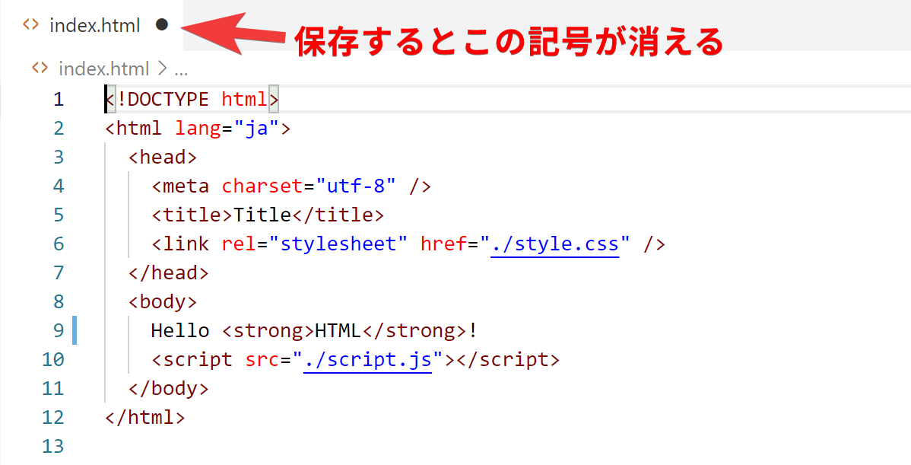
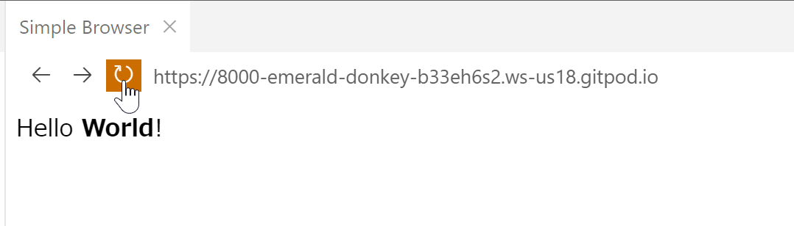
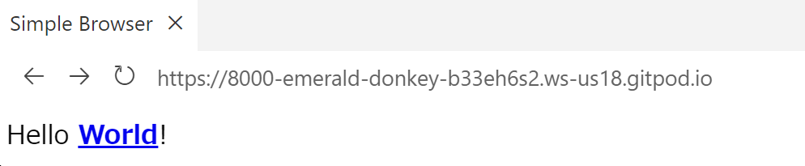
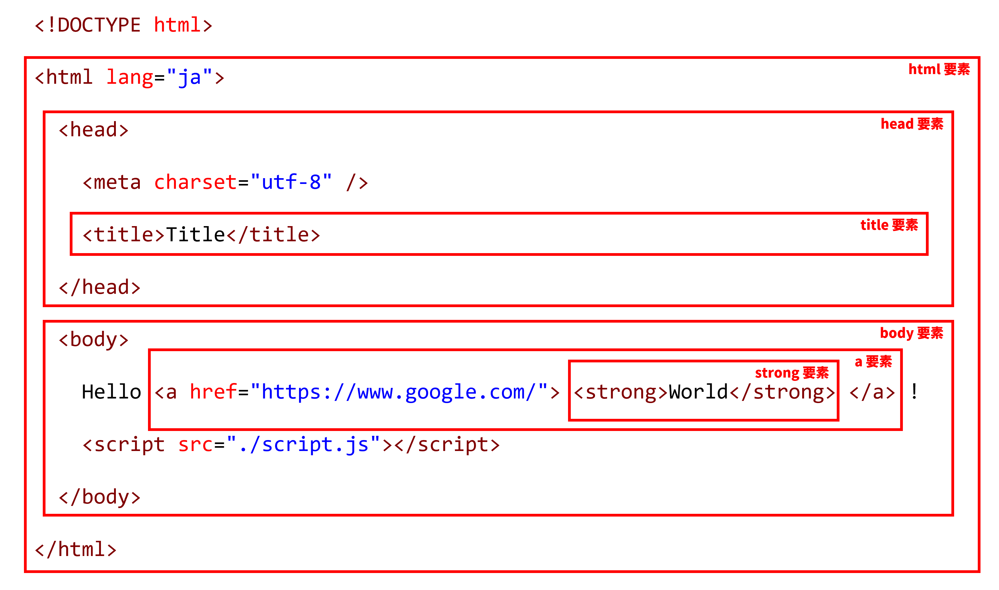
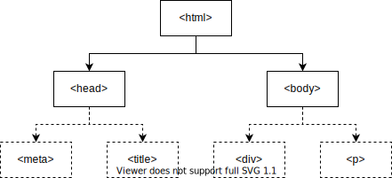

import Term from "@site/src/components/Term";

Web 開発に必ず用いられる言語があります。<Term type="html" strong>HTML</Term> と CSS、そして JavaScript です。これらは互いに異なる役割をもっています。まずは最も基本となる <Term type="html">HTML</Term> から学んでいきましょう。


## <Term type="html">HTML</Term> を書き始める

エディタの画面左端には、ファイル一覧が表示されています。まずは画面左端のパネルから `index.html` を開きましょう。



`index.html` の中身が表示されます。このファイルの中身を詳しく見ていきましょう。

```html title="index.html"
<!DOCTYPE html>
<html lang="ja">
  <head>
    <meta charset="utf-8" />
    <title>Title</title>
  </head>
  <body>
    Hello <strong>World</strong>!
    <script src="./script.js"></script>
  </body>
</html>
```

`<strong>World</strong>` の部分に注目してください。

<p><Term type="html">HTML</Term> ファイルは、文書に意味を持たせるために、<Term strong type="tag">タグ</Term>と呼ばれる構造を持つことができます。<Term type="tag">タグ</Term>は、<code>&lt;tag&gt;</code> のような、「小なり」と「大なり」で囲まれた英数字のまとまりです。</p>

<p><Term type="tag">タグ</Term>は、 <code><tag>内容</tag></code> のように、<Term type="tag">タグ</Term>名の先頭にスラッシュを付けるか否かの区別により<Term strong type="startTag">開始タグ</Term>と<Term strong type="endTag">終了タグ</Term>に分かれ、内部にテキストや別のタグを挟み込むことができます。<Term type="startTag">開始タグ</Term>から<Term type="endTag">終了タグ</Term>までのまとまりを<Term strong type="element">要素</Term>といいます。</p>

テキストの部分を次のように置き換えてみましょう。

```html title="index.html"
Hello <a href="https://www.google.com/"><strong>World</strong></a>!
```

<p><Term type="html">HTML</Term> を編集したら、<code>Cmd (Ctrl) + S</code> キーを押してファイルを保存します。ファイル名の横に表示されている丸い記号が消えたら保存が完了しています。</p>



保存したら、画面上の更新ボタンを押して、ページを再読み込みします。



`<a href="https://www.google.com/">～</a>` は **a <Term type="element">要素</Term>** です。<Term type="startTag">開始タグ</Term>の中に `href="https://www.google.com/"` という部分があります。これが<Term strong type="attribute">属性</Term>です。<Term type="attribute">属性</Term>は、<Term type="startTag">開始タグ</Term> の中に `属性名="値"` のように記述され、<Term type="element">要素</Term>の特徴を表します。`a` <Term type="element">要素</Term>の **href <Term type="attribute">属性</Term>**は、ハイパーリンクのリンク先を表す<Term type="attribute">属性</Term>です。



ハイパーリンクが設定されました。この例では `a` <Term type="element">要素</Term>の中に `strong` <Term type="element">要素</Term>が含まれています。このように、HTML タグは<Term strong type="htmlNest">ネスト</Term>させることにより、効果を重ね掛けすることができます。



## <Term type="html">HTML</Term> の文法

それでは、作成した <Term type="html">HTML</Term> をもう一度見直してみましょう。

すべての <Term type="html">HTML</Term> ファイルは、

```html title="index.html"
<!DOCTYPE html>
```

という、「このファイルは <Term type="html">HTML</Term> ファイルだ！」と宣言する定型句から始まります。

続けて記述されるのは `<html lang="ja">` 、つまり **html <Term type="element">要素</Term>** です。<Term type="html">HTML</Term> は、この html <Term type="element">要素</Term>を根とした木構造になっています。このため、html <Term type="tag">タグ</Term>の閉じ<Term type="tag">タグ</Term>はファイルの末尾に現れます。

html <Term type="element">要素</Term>の直属の子<Term type="element">要素</Term>は、**head <Term type="element">要素</Term>**と**body <Term type="element">要素</Term>**の二つだけです。このうち、後者 (body <Term type="element">要素</Term>) が実際にブラウザの表示領域上に表示されることになります。



:::info
ブラウザの画面内に表示される情報を表すのは `body` <Term type="element">要素</Term>中だけなので、<Term type="html">HTML</Term> ファイルの編集は通常 `body` <Term type="element">要素</Term>内部が中心となります。このドキュメントでも、これ以降掲載する <Term type="html">HTML</Term> のサンプルコードは `body` <Term type="element">要素</Term>内部のみを記述することとします。
:::
